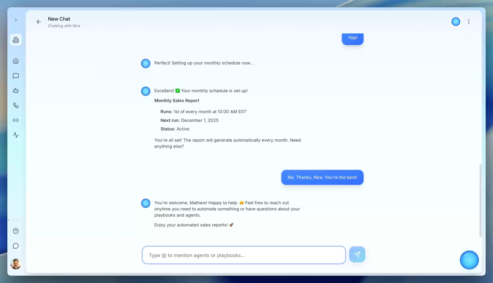

# NimbleBrain

**The first business automation platform you talk to.**

No flowcharts. No setup. Just describe what you need, and Nira, your AI operations assistant, builds and runs it for you.

[Learn more at nimblebrain.ai →](https://www.nimblebrain.ai)

  

## What is NimbleBrain?

Most automation tools make you think like a programmer: dragging boxes, connecting nodes, debugging flows. NimbleBrain is different.

**You talk. Nira does the rest.**

- "Send me a Slack summary of all open support tickets every morning"
- "When a new lead comes in, check if they're in our CRM and alert the sales team"
- "Screen resumes against this job description and rank the top 10"

Nira understands what you need, connects to your tools, and handles it automatically.

## Get Started

|                                                      |                             |
| :--------------------------------------------------- | :-------------------------- |
| [**Try NimbleBrain**](https://studio.nimblebrain.ai) | Start automating in minutes |
| [**Documentation**](https://docs.nimblebrain.ai)     | Guides and API reference    |
| [**Website**](https://www.nimblebrain.ai)            | See how it works            |

## Open Source

We're building in the open. These tools power parts of our platform:

- [**nimbletools-core**](https://github.com/NimbleBrainInc/nimbletools-core) - Deploy AI tools as production services
- [**ntcli**](https://github.com/NimbleBrainInc/ntcli) - Command-line interface for developers
- [**mcp-registry**](https://github.com/NimbleBrainInc/mcp-registry) - Community registry of MCP servers

## Connect

- [Discord](https://www.nimblebrain.ai/discord) - Join the community
- [Twitter](https://twitter.com/nimblebrain) - Follow for updates
